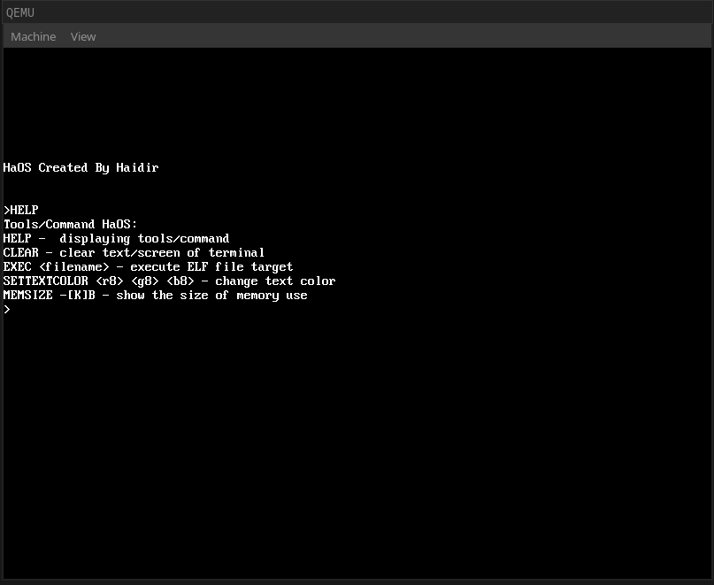

# HaOS
HaOS is the operating system that created from scratch. This operating system is 64 bits which is 4GB or above
HaOS basically make it as 32 bits. But in the world the technology has change, I finally make 64 bits Operating System based on documentation os [OSDev Wiki]( https://wiki.osdev.org) 

Some of code are taking and test from source code on OSDev Wiki to make sure it working fine or not. After that, I try to implemented by myself.
<!-- Thus of that, this project i gave the CC0-Universal so that you can take, modify, create or whatever you want to do.
This is my hobby project create since I live in college. -->

## Operating System
What is Operating System. Operating System is the system that operate on machine like computer or laptop to run the program. The exists Operating System, OS is Windows, MacOS, Linux and more.

## Update
- Now, I'm so excited to share with you the progress of this OS:
    - I have made UEFI ( Unified Extension Firmware Interface ) for modern PC/Laptop
    - Multitasking has been finish but it still on TEST
- But, I have sad news because, Bootloader/Bootstage will not continue for future due to using UEFI. And we taking back License for temporary time for this project.

## Overview 


## Requirement
- You must installing x86_64-elf or configure manually on Makefile
- If you have QEMU, you must install OVMF for UEFI boot

## Installation / How to Compile
```sh
git clone https://github.com/HaidirGameCraft/HaOS
cd ./HaOS
```

After that you need to adjust the configuration of Compiler on Makefile
```sh
GCC_COMPILER=/path/to/gcc
LD_COMPILER=/path/to/ld
GNU_AS_COMPILER=/path/to/as
ASM_COMPILER=/path/to/nasm
```

And now, we compile
```sh
# Compile
make

# Run the OS (QEMU Only)
# You need to download OVMF to run the this OS throught UEFI
make run_uefi
```

## Details
<!-- - This is operating system will run under bootloader (Legacy Mode, BIOS) not UEFI, due the lack of information of UEFI, how to read disk, mapped and make new page directory after running the kernel with the kernel is Protected Mode (32 bits) not Long Mode (64 bits) -->
- This is operating system will run under UEFI and not Bootloader at all.
- Since kernel is 1 MB above, need to mapped into higher half kernel, meaning need to make/enable paging from bootloader by providing some frame to save:
    - PMLT4: (Addr=0x1000, Size=0x1000)
    - PDPT: (Addr=0x2000, Size=0x1000)
    - PDT: (Addr=0x3000, Size=0x1000)
    - PT: (Addr=0x4000, Size-0x1000)
    - Frame: (Addr=0x5000, Size-0x1000)
    - Page Bitmap: (Addr=0x6000, Size=0x1000)
- Changing the kernel address into higher half kernel (0xFFFFFFFF80000000), easy the program running above 1 MB
- The code is messy right now without the details of comment due to fix/change/abjust/improve the program. I will clean the code next time.

# Improvement
- Since, this is my hobby project, I have a lot improvement that i make such as ELF64 that you can run program in this Operating System. it is a test because not properly working.
- implement 64 bits kernel and bootstage

## References And Acknowledges
- [OSDev Wiki](https://wiki.osdev.org): The valuable resource of Operating System
